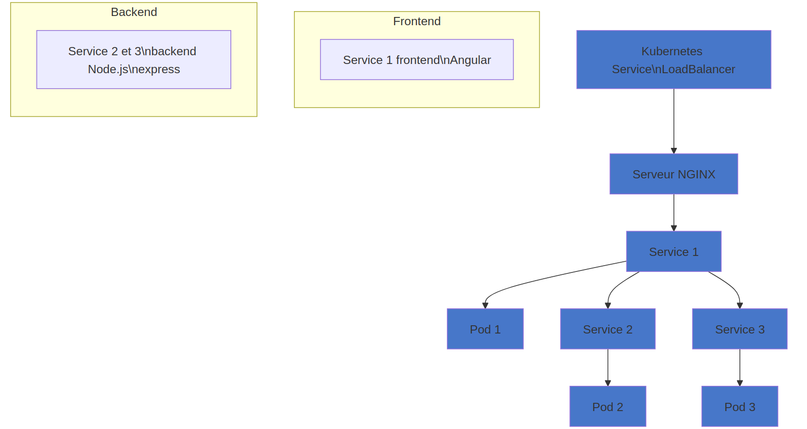

# 1- Configuration du serveur unique pour la gestion des requêtes

## Présentation

Cette configuration met en place un serveur NGINX unique qui agit comme un serveur proxy inverse. Toutes les requêtes entrantes passent par ce serveur NGINX qui distribue ensuite les requêtes aux différents services backend (catalog-service, order-service) et au frontend (frontend-app).
###NB: Cette partie est pour la branche "master" :
## Fonctionnement

### Requêtes des utilisateurs
Les utilisateurs envoient leurs requêtes à NGINX via `http://localhost:80`.

### Proxy inverse
NGINX reçoit les requêtes et les redirige vers les services appropriés en fonction des chemins spécifiés :

- Les requêtes vers `/api/products` sont proxy-passées à `http://catalog-service:3001/products`.
- Les requêtes vers `/api/orders` sont proxy-passées à `http://order-service:3002/orders`.
- Les autres requêtes (`/`) sont proxy-passées à `http://frontend:80`.

Cette configuration permet de centraliser la gestion des requêtes et de simplifier la communication entre les différents composants de l'application.

## Avantages

- **Centralisation des requêtes** : Toutes les requêtes passent par un seul serveur NGINX, facilitant la gestion et la supervision du trafic.
- **Découplage des services** : Les services backend (catalog-service, order-service) et le frontend (frontend-app) sont découplés et peuvent être déployés et gérés indépendamment.
- **Évolutivité** : Cette configuration permet de facilement ajouter ou modifier des services backend sans impacter le frontend.
- **Sécurité** : NGINX peut également jouer un rôle dans la sécurisation des communications, en gérant les aspects de SSL/TLS, de sécurité des en-têtes HTTP, etc.

## Comparaison avec la branche "master"
La configuration sur la branche "master" utilise également NGINX comme serveur proxy, mais dans une architecture plus simple avec un seul serveur.
La branche "feature/multiserveur-nginx" introduit une architecture multi-serveurs plus évolutive, avec un découplage plus important entre les composants backend et frontend.

# 2-Créer les configurations NGINX pour chaque service:
La branche "feature/multiserveur-nginx" introduit une architecture multi-serveurs:
Maintenant, chaque service devrait être accessible via son propre conteneur NGINX :

    catalog-service via http://localhost:8081

    order-service via http://localhost:8082

    frontend-app via http://localhost:8083

# 3-Architecture Kubernetes

Cette architecture utilise un service Kubernetes (de type LoadBalancer) pour exposer trois services Node.js déployés en tant que Pods dans un cluster Kubernetes.

## Diagramme de l'architecture
```
+-----------------------------+------------------+
|        Kubernetes Service (LoadBalancer)       |
+-----------------------------+------------------+
            /                |               \
           /                 |                \
          v                  v                 v
+-------------+      +-------------+      +-------------+
|  Service 1  |      |  Service 2  |      |  Service 3  |
|  (Node.js)  |      |  (Node.js)  |      |  (Node.js)  |
+-------------+      +-------------+      +-------------+
      |                   |                    |
      v                   v                    v
+--------------+    +--------------+     +--------------+
|    Pod 1     |    |    Pod 2     |     |    Pod 3     |
|(Docker image)|    |(Docker image)|     |(Docker image)|
+--------------+    +--------------+     +--------------+
```

## Composants de l'architecture

1. **Service Kubernetes (LoadBalancer)** : Ce service expose les trois services Node.js à l'extérieur du cluster Kubernetes. Il utilise le type `LoadBalancer` pour fournir une adresse IP publique accessible depuis l'extérieur.

2. **Services Node.js** : Ces trois services sont des applications Node.js déployées en tant que Pods dans le cluster Kubernetes. Ils communiquent avec le service Kubernetes pour recevoir les requêtes des clients.

3. **Pods** : Chaque service Node.js est encapsulé dans un Pod, qui contient l'image Docker correspondante.


# Architecture du Système dans la branche 'feature/k8s-deploy'

## Vue d'ensemble
Ce document décrit l'architecture d'un système distribué utilisant Kubernetes et différents services.

## Diagramme de flux




## Description des composants

### Infrastructure
- **Kubernetes Service (LoadBalancer)** : Point d'entrée principal qui gère la distribution du trafic
- **Serveur NGINX** : Serveur web qui agit comme reverse proxy

### Services
1. **Service 1**
   - Frontend développé en Angular
   - Gère le Pod 1
   - Communique avec Service 2 et Service 3

2. **Service 2**
   - Backend développé en Node.js/Express
   - Gère le Pod 2

3. **Service 3**
   - Backend développé en Node.js/Express
   - Gère le Pod 3

## Flux de données
1. Les requêtes entrent par le LoadBalancer Kubernetes
2. Le trafic est dirigé vers le serveur NGINX
3. NGINX route les requêtes vers Service 1
4. Service 1 peut :
   - Traiter la requête directement via Pod 1
   - Transférer la requête vers Service 2
   - Transférer la requête vers Service 3
5. Service 2 et Service 3 traitent leurs requêtes respectives via Pod 2 et Pod 3


